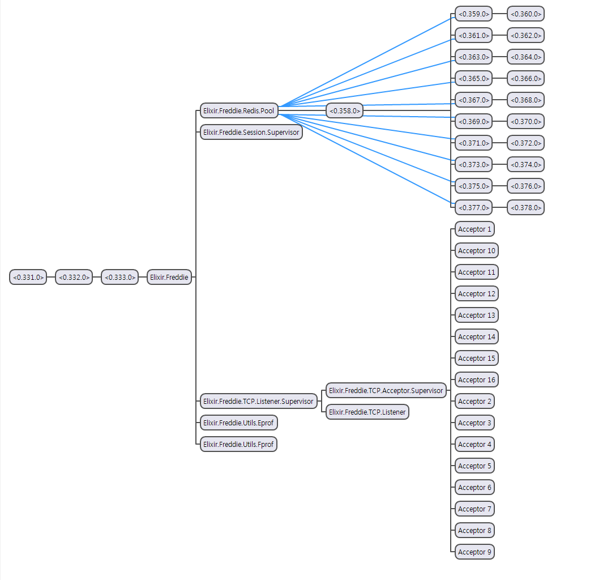

# Freddie: Elixir Socket Framework

See the getting started guide and the [online documentation](https://hexdocs.pm/freddie/).

## Overview

Freddie is the Socket Framework for the Elixir. It is written to work with optimized non-bloking socket IO, enabling clients to communicate very quickly. Use Google's protobuf as a unit of packets. Thus, it is easy to create an implementation on most platforms and languages. One protocol file per protocol is matched (Nested structures are also allowed). All messages are optionally encrypted based on AES256. For example, you can use encryption for security-critical messages, and in most cases, you can use it without encryption. All code in freddie is written to follow OTP and works fault-tolerance in the event of a failure. Currently, it can only be used with TCP restrictions, but it will support the RUDP protocol.



### Freddie

Freddie's internal structure can be separated in several ways. Each element works only for its own role.

- Router
  - Categorize the packets sent by the client and then dispatch them to each handler.
  - Unpacking and decrypting packets are provided internally.
  - Handlers for special cases such as connection and disconnection are also available.

- Session
  - This is the endpoint where the connection to each client is abstracted.
  - Freddie offers several protocols, but for one client, it works through Session.

- Context
  - The information in the Session and the user-available map are internal structures.
  - Corresponds with one context per session. Therefore, Session can be identified through Context.
  - Context is synchronized through Session, so synchronization is guaranteed for writing. However, when you read it in another process, you can temporarily see the context of the past.

- Scheme
  - Module defining packets used by the application.

- Protocols
  - Match the structure of each protocol and packet. 
  - This is where the protocol number is defined number.

## Installation

```console
$ mix local.hex
$ mix archive.install hex freddie_scaffold [version]
```

## Create Freddie Application

Create a project with the following commands:

```console
$ mix freddie.scaffold echo_server
```

## Configurate Application

Configure a confg/config.exs file

```elixir
# configure freddie
config :freddie,
  # Type app name
  app_mod: :echo_server,

  # Type listen port
  port: 5050,
  # Type size of acceptor pool
  acceptor_pool_size: 100,

  # Type redis host address
  redis_host: "localhost",
  # Type redis port
  redis_port: 6379,
  # Type size of redis pool
  redis_pool_size: 10,

  # Type packet scheme root mod
  scheme_root_mod: EchoServer.Scheme,
  # Type protocol type root mod
  packet_type_mod: EchoServer.Protocols.Types,
  # Type packet handler mod (derive from Freddie.Router)
  packet_handler_mod: EchoServer.Handler
```

## Add Protocol Schemes

You can add a schema for the protocol under the path 'lib/echo_server/scheme'

### lib/echo_sever/scheme/cs_echo.proto

```proto
syntax = "proto3";

message CS_Echo {
    string msg = 1;
}
```

### lib/echo_server/scheme/sc_echo.proto

```proto
syntax = "proto3";

message SC_Echo {
    string msg = 1;
}
```

## Define Protocol

And then you define spec of protocols like this

### lib/echo_server/protocols.ex

```elixir
defmodule EchoServer.Protocols do
  use EnumType

  # define protocol type and protocol number (please type full name of schemes)
  defenum Types do
    # echo
    value(EchoServer.Scheme.CS_Echo, 1)
    value(EchoServer.Scheme.SC_Echo, 2)
  end
end
```

## Add Protocol Handler

Finally, you define protocol-specific processes in handler.

### lib/echo_server/handler.ex

```elixir
defmodule EchoServer.Handler do
  use Freddie.Router

  require Logger

  alias EchoServer.Handler

  # define (Client-Server) type protocol handler
  defhandler EchoServer.Scheme.CS_Echo do
    {meta, msg, context}
    |> Handler.Echo.handle()
  end

  # define connnection event handler
  connect do
    Logger.info("Client #{inspect(context)} is connected!")
  end

  # define disconnection event handler
  disconnect do
    Logger.info("Client #{inspect(context)} is disconnected!")
  end
end
```

### lib/echo_server/handler/echo.ex

```elixir
defmodule EchoServer.Handler.Echo do
  alias EchoServer.Scheme

  def handle({_meta, msg, context}) do
    # make response message
    response_packet =
      [{:msg, msg.msg}]
      |> Keyword.new()
      |> Scheme.SC_Echo.new()

    # send a meesage to session using context
    Freddie.Session.send(context, response_packet)
  end
end
```

## Start Application

Start the server with the following command

start server with iex:

```console
$ iex --erl "+spp true +K true +Q 65536 +IOp 2 +scl false" -S mix freddie.server start
```

or

start server without iex:

```console
$ elixir --erl "+spp true +K true +Q 65536 +IOp 2 +scl false" -S mix freddie.server start
```

## Todo

1. Provides Reliable UDP communication(Guarantee the latest order or Guaranteed both sequence and retransmission)
2. Optimize network code
3. Divide transmission into reliable and unreliable
4. Add scaffold mix tool
5. Add route mix tool & web page for dev

## Examples

[example projects](https://github.com/kernelgarden/freddie_example)